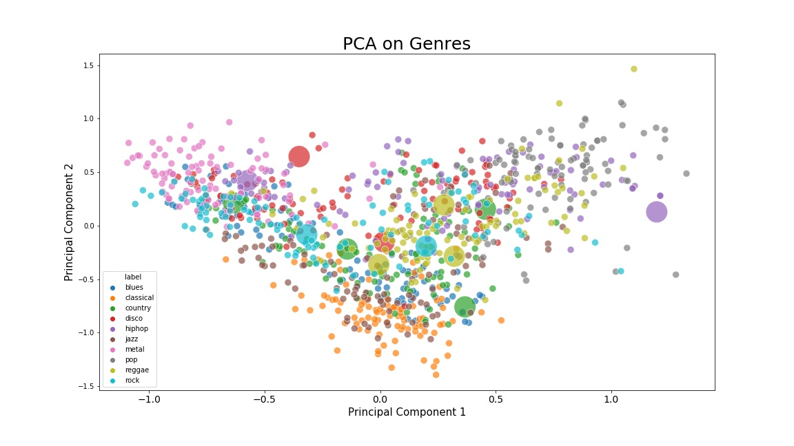

# AML24MST
This is the reposirory for the mini-project in Advanced Machine Learning 2024 at IT-University of Copenhagen.

## Group Members
Anders Hjulmand: ahju@itu.dk

Eisuke Okuda: eiok@itu.dk  

Andreas Flensted: frao@itu.dk

## Data and Objective
The objective of this project is to build a classifier that can tag pieces of music with a genre. 

We use the [GTZAN Dataset](https://www.kaggle.com/datasets/andradaolteanu/gtzan-dataset-music-genre-classification) which is the most-used public dataset for evaluating music genre recognition in machine learning. The dataset consists of 10 genres with 100 audio files of 30 second each. For each genre, the data is split into training (60), validation (20), and test (20).

The main goals of the project is to:

1. Compare the performance of different pre-processing options (raw waveform vs. spectograms). 
2. Compare different model architectures: spectogram CNN vs. transformers.
3. Examine whether including noisy- and generated data as training examples improves the robustness of the models.

## Methods

We fine-tune three pre-trained model architectures to classify music genres in the GTZAN:

1. CNN
2. Audio Spectogram Transformer (AST) - [Paper](https://arxiv.org/abs/2104.01778): which is an attention-based vision transformer model used for audio classification. The audio is first turned into a spectogram, then projected onto an embedding space, after which a vision transformer is applied. We use a model pretrained on the [AudioSet](https://research.google.com/audioset/) consisting on a variety of audio classes including music and speech. This corresponds to the 1st model on the [GitHub from ](https://github.com/YuanGongND/ast/tree/master?tab=readme-ov-file). A learning rate of 5e-5 for fine-tuning. 
4. Hubert - [Paper](https://arxiv.org/abs/2106.07447): 


## Key Experiments and Results

We examine whether augmenting the training data with noisy and generated music pieces improves the performance.

We create noisy training data by adding Additive White Gaussian Noise (AWGN) with a signal-to-noise-ratio of $10$ to the original training examples.

We generate ...  


Accuracy scores are shown in the table below.  

|          | ResNet | AST | HuBERT |
|----------|----------|----------|----------|
| Baseline data             | .692   | .775   | .795   |
| Baseline + Noise data     | .705   | .740   | .780   |
| Baseline + Generated data | .686   | .755   | .795   |


The figure below shows the confusion Matrix for the AST model fine-tuned on baseline data.


The figure below plots the first two principal components of all the songs in the original dataset. Large songs indicates test-set songs that were misclassified by all 9 models. 



## Discussion


## Installation
Clone or download this repository and set it as the working directory, create a virtual environment and install the dependencies.

```bash
python -m venv venv
source venv/bin/activate #Mac/Linux
.\venv\Scripts\activate.bat #Windows
pip install -r requirements.txt 
```

## Create Datasets

Step 1: Download the GTZAN dataset from Kaggle using the following link:
[GTZAN Dataset - Music Genre Classification](https://www.kaggle.com/datasets/andradaolteanu/gtzan-dataset-music-genre-classification). Save the dataset in a new folder *.data/* 

Step 2: Create train/test split data, and noise data by running the following:
```bash
python create_train_val_test_data.py
python create_noise_data.py
```

Step 3:

Create generated data by running the notebook MusicGen.ipynb.

## Fine-tune models

After creating the datasets, the following notebooks can br run to fine-tune the models:

* transfer_CNN.ipynb
* finetune_ast.ipynb
* hubert.ipynb


